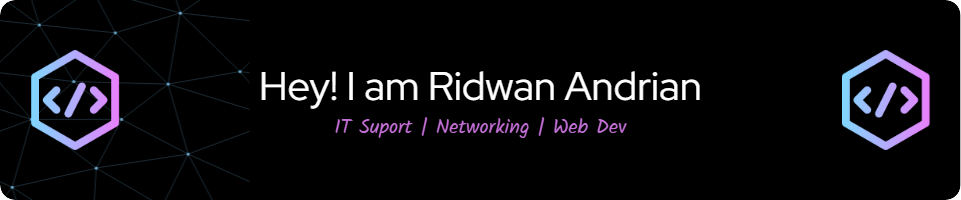

# 💫 About Me:
I’m an enthusiastic IT Support professional and Technical Support Specialist, experienced in diagnosing and resolving issues related to networking, hardware, and software. I’m passionate about helping others through technology and keeping systems running efficiently.  🔧 Skills: Network Troubleshooting, Hardware/Software Repair, IT Support 🌱 Currently exploring full-stack web development and AI to broaden my tech capabilities.

## 🌐 Socials:
   

# 💻 Tech Stack:
     
# 📊 GitHub Stats:

  
  
  

## 🏆 GitHub Trophies

  

### ✍️ Random Dev Quote

---

Profile Views

  

<!-- Proudly created with GPRM ( https://gprm.itsvg.in ) -->
## Pacman Game 
<picture>
  <source media="(prefers-color-scheme: dark)" srcset="https://raw.githubusercontent.com/SunnFlower47/SunnFlower47/output/pacman-contribution-graph-dark.svg">
  <source media="(prefers-color-scheme: light)" srcset="https://raw.githubusercontent.com/SunnFlower47/SunnFlower47/output/pacman-contribution-graph.svg">
  
</picture>

